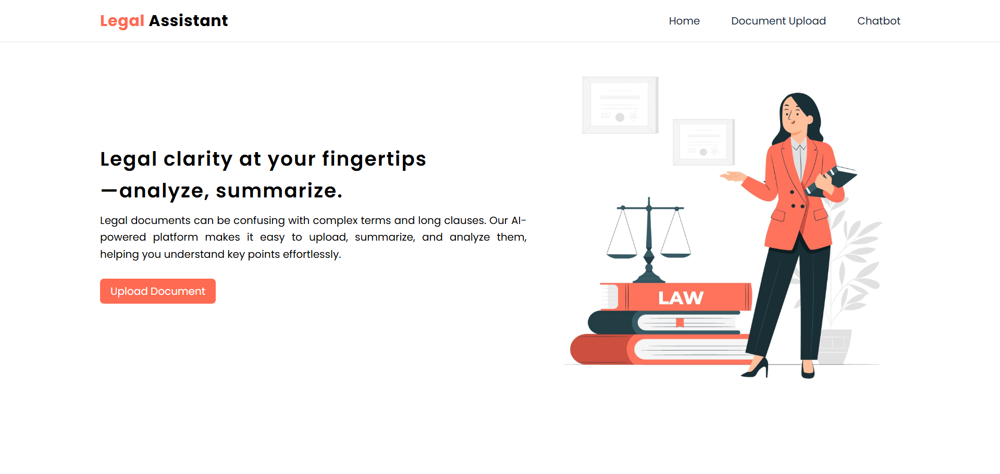
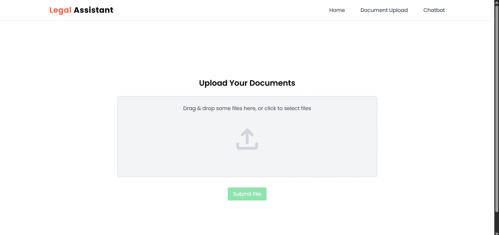
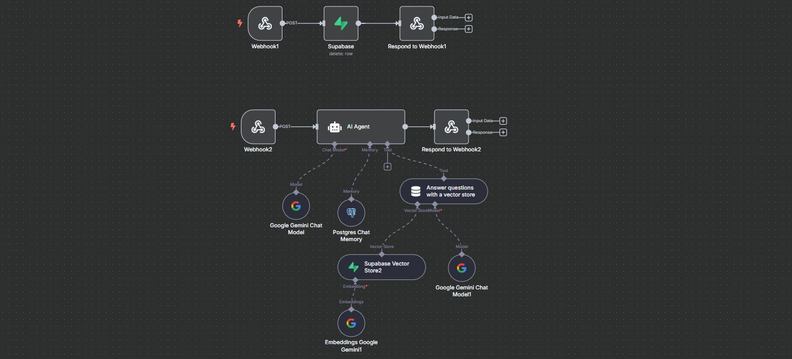
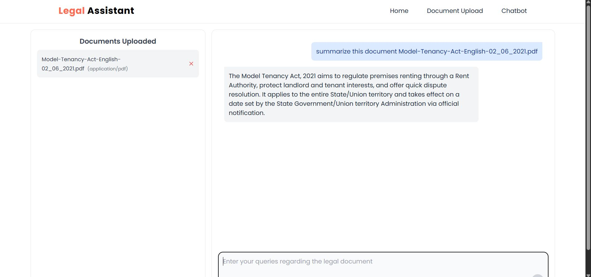
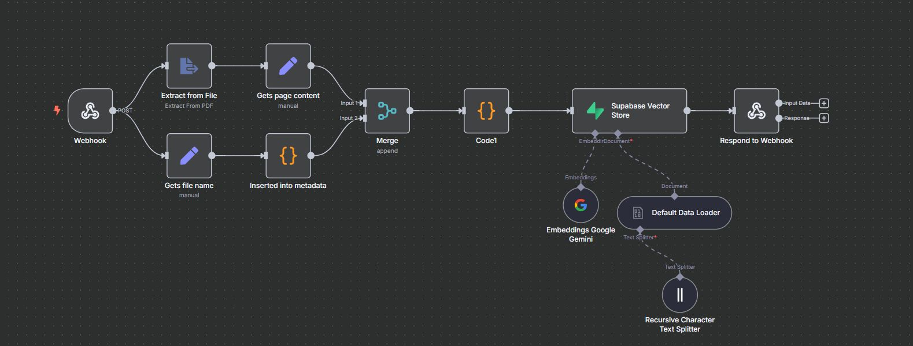

<h1 align="center">
  <span style="padding: 0.2em 0.6em; border-radius: 6px;">
    Legal Assistant
  </span>
</h1> 

Legal Assistant is an AI-powered legal document query platform built using **n8n**. It allows users to upload legal PDFs, store them in a vector database using embeddings, and ask natural language questions. It uses **RAG (Retrieval-Augmented Generation)** to fetch the most relevant content and respond accurately, making legal document interpretation fast, accurate, and user-friendly.

---

## 🚀 Live Demo
https://legal-assistant-teal.vercel.app/

---

## 🔍 Features

- 📁 Upload PDFs and extract text using OCR  
- 🧠 Generate embeddings using Google Gemini and store in Supabase vector DB  
- 🧾 RAG-powered semantic search to answer legal queries  
- 🧼 Delete uploaded documents from the store when needed  
- 🔐 Secure query processing with session-based chat memory in Postgres  
- ⚙️ Fully customizable and extendable via n8n workflow editor  

---

## 📄 Pages / Endpoint Description


### 1. **Landing Page**
<p align="center">
  
</p>

---

### 2. **File Upload **
- Accepts PDF uploads
- Extracts content and metadata
- Chunks text, generates embeddings, and stores in Supabase
<p align="center">
  
</p>
<p align="center">
  
</p>

---

### 3. **Query Endpoint (Ask Questions)**
- Accepts natural language queries and session ID
- Retrieves most relevant chunks using semantic search
- Generates the response based on retrieved context
<p align="center">
  
</p>
<p align="center">
  
</p>


---

## 🛠️ Installation Instructions

### 1. Clone the repository

```bash
git clone https://github.com/KarthikeyaTadiparti/Legal-assistant-n8n.git
cd Legal-assistant-n8n
```

### 2. Install n8n CLI 

```bash
npm install -g n8n
```

### 3. Start n8n locally

```bash
n8n
```

### 4. Install dependencies

```bash
# Client setup
cd client
npm install

# Server setup
cd server
npm install
```

### 4. Run the application

```bash
# Start server
cd server
npm run dev

# In a new terminal, start client
cd client
npm start
```


